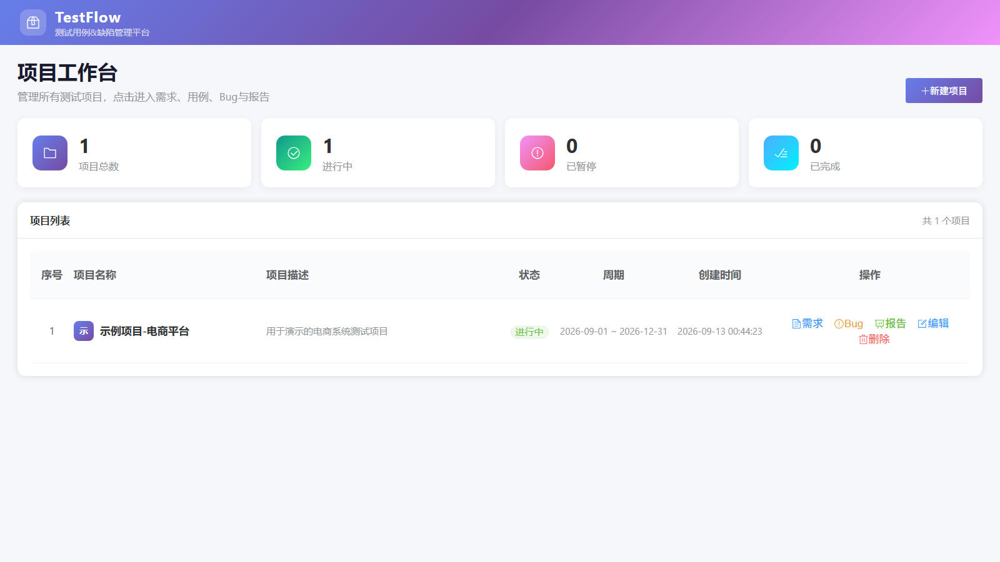
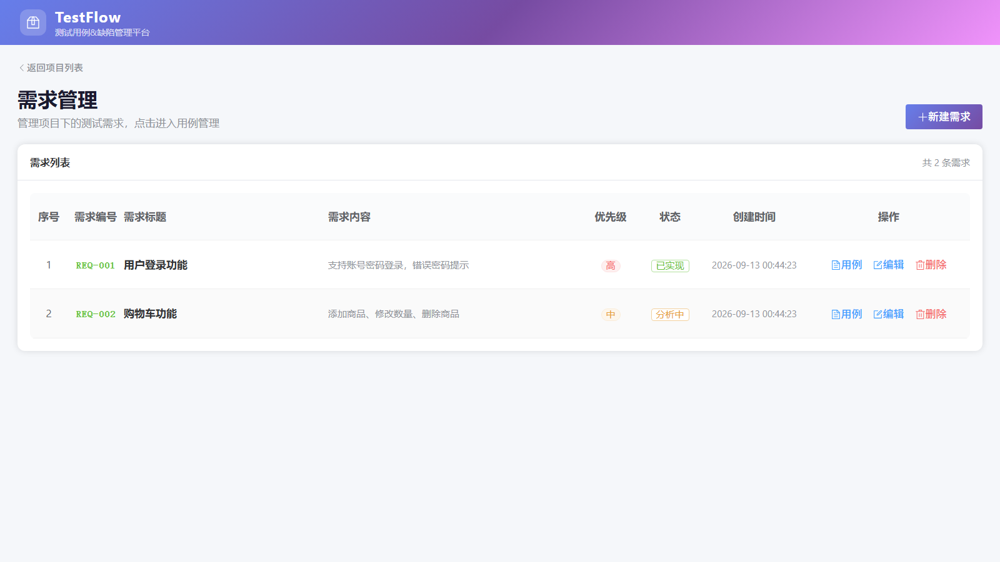
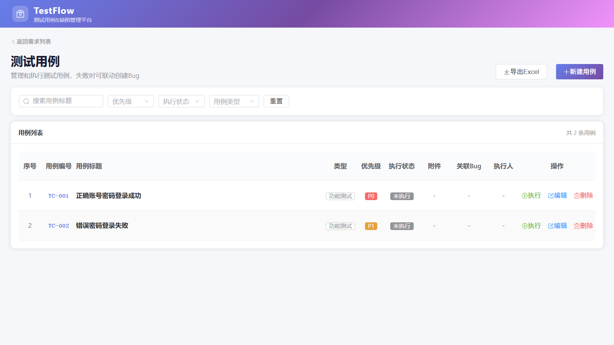
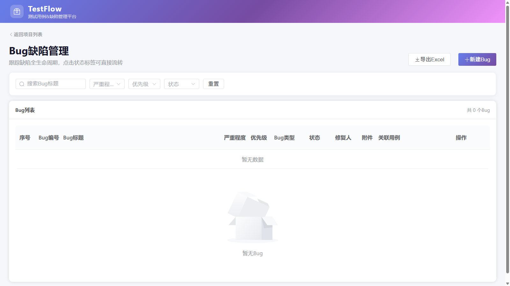
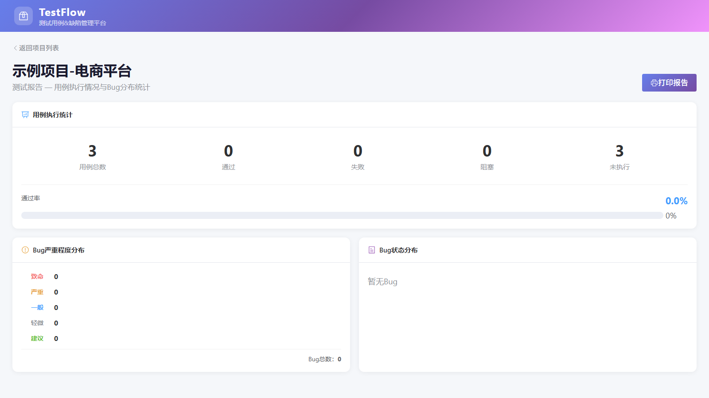

# TestFlow - 轻量测试用例与缺陷管理平台

> 基于 SpringBoot3 + Vue3 + SQLite 的轻量级测试管理平台，覆盖需求→用例→执行→Bug→报告完整测试流程，适合个人和小团队使用。


## 界面预览

| 项目工作台 | 需求管理 |
|:---:|:---:|
|  |  |
| 测试用例管理 | Bug缺陷管理 |
|  |  |
| 测试报告 | - |
|  | - |

## 功能特性

### 项目管理
- 项目的增删改查，支持项目状态（进行中/已完成/已暂停）
- 每个项目独立管理需求、用例、Bug

### 需求管理
- 需求的增删改查，自动生成需求编号（REQ-001）
- 需求优先级（高/中/低）、状态（待分析/分析中/已实现）

### 测试用例管理
- 用例的增删改查，自动生成用例编号（TC-001）
- 完整字段：所属模块、测试目的、前置条件、测试步骤、预期结果、优先级（P0-P3）、用例类型、备注
- 用例执行：标记通过/失败/阻塞，填写实际结果、执行人
- 执行失败时支持**联动创建Bug**，附件自动同步
- 支持多附件上传（图片、日志、文档等，单文件最大20MB）
- 用例与Bug双向关联，用例列表可查看关联Bug编号

### Bug缺陷管理
- Bug的增删改查，自动生成Bug编号（BUG-001）
- 完整字段：所属模块、影响版本、Bug类型、严重程度（致命/严重/一般/轻微/建议）、优先级（P0-P3）、重现步骤、预期结果、实际结果、测试环境、附件
- **状态机流转**：新建→待修复→已修复→已验证→关闭，非法流转后端拦截
- 关联测试用例，支持下拉选择
- Bug详情弹窗，附件支持图片预览和文件下载

### 测试报告
- 用例通过率统计（阻塞不计入分母）
- Bug严重程度分布、状态分布
- 项目维度的整体测试数据概览

### 导出功能
- 测试用例、Bug列表一键导出Excel
- 表头加粗、全表边框
- 每个附件单独占一列，图片嵌入单元格，非图片文件为可点击超链接
- 中文文件名保留，导出文件名含日期

## 技术栈

| 层级 | 技术 | 版本 |
|------|------|------|
| 后端框架 | Spring Boot | 3.2.5 |
| ORM | MyBatis | 3.0 |
| 数据库 | SQLite | 3.x |
| 构建工具 | Maven | 3.9+ |
| 前端框架 | Vue | 3.4+ |
| UI组件库 | Element Plus | 2.7+ |
| 构建工具 | Vite | 5.x |
| HTTP客户端 | Axios | 1.x |
| Excel导出 | ExcelJS | 4.x |
| 自动化测试 | pytest + requests | - |

## 快速开始

### 环境要求
- JDK 17+
- Maven 3.9+
- Node.js 18+
- npm 9+

### 后端启动

```bash
# 进入后端目录
cd backend

# 启动（默认端口8080）
mvn spring-boot:run
```

启动后自动创建数据库表和示例数据，数据库文件位于 `backend/data/test_platform.db`。

### 前端启动

```bash
# 进入前端目录
cd frontend

# 安装依赖
npm install

# 启动开发服务器（默认端口5173）
npm run dev
```

浏览器访问 `http://localhost:5173` 即可使用。

### 运行自动化测试

```bash
cd tests
python -m pytest -v
```

共38个接口自动化用例，覆盖项目、需求、用例、Bug、报告全部模块。

## 项目结构

```
test-platform/
├── backend/                    # SpringBoot 后端
│   ├── src/main/java/com/testplatform/
│   │   ├── TestPlatformApplication.java   # 启动类
│   │   ├── common/Result.java             # 统一响应封装
│   │   ├── config/
│   │   │   ├── DataInitializer.java       # 示例数据初始化
│   │   │   └── WebMvcConfig.java          # 静态资源映射（/uploads）
│   │   ├── controller/                    # 控制层（5个Controller）
│   │   ├── service/                       # 业务层（5个Service）
│   │   ├── mapper/                        # 数据访问层（注解+XML混合）
│   │   ├── entity/                        # 实体类（4个实体）
│   │   └── dto/ExecuteCaseRequest.java    # 执行用例请求DTO
│   ├── src/main/resources/
│   │   ├── application.yml                # 应用配置
│   │   ├── db/schema.sql                  # 建表脚本
│   │   └── mapper/*.xml                   # MyBatis XML映射
│   └── data/test_platform.db              # SQLite数据库文件（自动生成）
├── frontend/                   # Vue3 前端
│   ├── src/
│   │   ├── App.vue                        # 主布局（导航栏）
│   │   ├── main.js                        # 入口文件
│   │   ├── router/index.js                # 路由配置
│   │   ├── utils/
│   │   │   ├── request.js                 # Axios封装
│   │   │   └── excelExport.js             # Excel导出工具（带样式+图片嵌入）
│   │   └── views/                         # 5个页面
│   │       ├── ProjectList.vue            # 项目列表（首页）
│   │       ├── RequirementList.vue        # 需求管理
│   │       ├── CaseList.vue               # 测试用例管理&执行
│   │       ├── BugList.vue                # Bug缺陷管理
│   │       └── ReportView.vue             # 测试报告
│   └── vite.config.js                     # Vite配置（代理/api和/uploads）
├── tests/                      # pytest 接口自动化测试
│   ├── conftest.py                      # 测试配置
│   ├── test_project.py                  # 项目模块测试
│   ├── test_requirement.py              # 需求模块测试
│   ├── test_case.py                     # 用例模块测试
│   ├── test_bug.py                      # Bug模块测试
│   └── test_report.py                   # 报告模块测试
├── README.md
├── 数据库设计文档.md
└── 简历项目描述&面试要点.md
```

## API 接口

所有接口统一前缀 `/api`，统一响应格式 `{ code, message, data }`。

| 模块 | 方法 | 路径 | 说明 |
|------|------|------|------|
| 项目 | GET | /api/projects | 查询项目列表 |
| 项目 | POST | /api/projects | 新增项目 |
| 项目 | PUT | /api/projects/{id} | 编辑项目 |
| 项目 | DELETE | /api/projects/{id} | 删除项目 |
| 需求 | GET | /api/requirements?projectId= | 按项目查需求 |
| 需求 | POST | /api/requirements | 新增需求 |
| 需求 | PUT | /api/requirements/{id} | 编辑需求 |
| 需求 | DELETE | /api/requirements/{id} | 删除需求 |
| 用例 | GET | /api/cases?requirementId= | 按需求查用例 |
| 用例 | POST | /api/cases | 新增用例 |
| 用例 | PUT | /api/cases/{id} | 编辑用例 |
| 用例 | DELETE | /api/cases/{id} | 删除用例 |
| 用例 | POST | /api/cases/{id}/execute | 执行用例（支持联动建Bug） |
| Bug | GET | /api/bugs?projectId= | 按项目查Bug |
| Bug | POST | /api/bugs | 新增Bug |
| Bug | PUT | /api/bugs/{id} | 编辑Bug |
| Bug | DELETE | /api/bugs/{id} | 删除Bug |
| Bug | PUT | /api/bugs/{id}/status | Bug状态流转（带校验） |
| 报告 | GET | /api/reports/{projectId} | 生成测试报告数据 |
| 文件 | POST | /api/upload | 文件上传（返回可访问URL） |

## 设计亮点

1. **Bug状态机**：后端定义合法流转规则，非法状态变更直接拦截，保证缺陷生命周期规范
2. **用例-Bug双向追溯**：用例执行失败联动建Bug，用例列表可查看关联Bug编号，Bug可查看关联用例编号和标题
3. **多附件支持**：用例执行和Bug都支持多附件，逗号分隔存储，前端自动拆分展示
4. **中文文件名保留**：上传文件命名为 `UUID_原始文件名`，既避免重名又保留中文名
5. **Excel导出带样式**：表头加粗、全表边框、图片嵌入单元格、非图片文件超链接
6. **阻塞不计入通过率**：执行状态含"阻塞"，统计通过率时阻塞用例不计入分母，符合行业标准
7. **编号自动生成**：用例/需求/Bug编号按当前父级数量+1自动生成（TC-001格式）

## 部署说明

### 后端打包
```bash
cd backend
mvn clean package -DskipTests
java -jar target/test-platform-1.0.0.jar
```

### 前端打包
```bash
cd frontend
npm run build
# 产物在 dist/ 目录，可部署到Nginx等静态服务器
```

### Nginx 配置参考
```nginx
server {
    listen 80;
    server_name your-domain.com;

    root /path/to/dist;
    index index.html;

    location / {
        try_files $uri $uri/ /index.html;
    }

    location /api/ {
        proxy_pass http://localhost:8080;
    }

    location /uploads/ {
        proxy_pass http://localhost:8080;
    }
}
```

## License

MIT License
